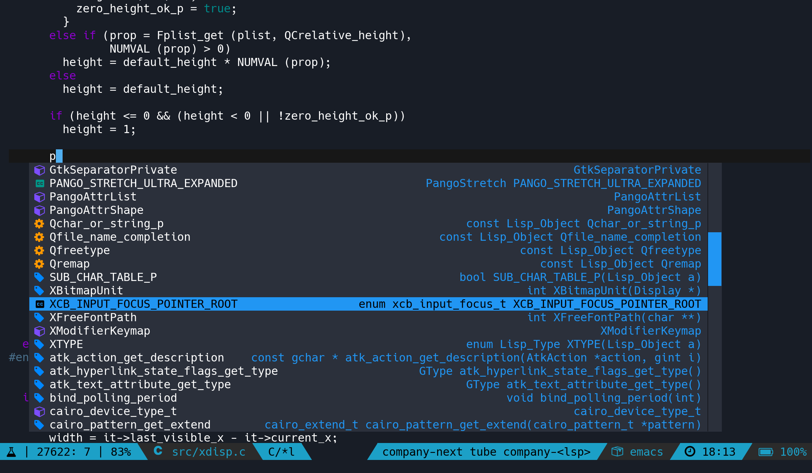

# company-next

A company front-end.  



Why is it better than the built-in front-end:  
- Differents colors for differents backends.
- Icons associated to functions/variables/..
- Not limited by the current window size, buffer's text properties, ..

This package requires emacs 26.  
Also, not compatible with emacs in a tty.  

If you want icons, please install [icons-in-terminal](https://github.com/sebastiencs/icons-in-terminal)  

### Installation
``` el
;; With use-package:
(use-package company-next
  :hook (company-mode . company-next-mode))

;; Or:
(require 'use-package)
(add-hook 'company-mode-hook 'company-next-mode)
```

To customize:  
`M-x customize-group [RET] company-next [RET]`   

### Backends colors

See the docstring of the variable `company-next-backends-color`:  
`C-h v company-next-backends-color`

### Icons

See the variable `company-next-icons-functions`  

For now, there are customs icons for 3 backends only: `company-lsp`, `company-elisp` and `company-yasnippet`.  
You can customize the icons with the variables:  
`company-next-icons-lsp`, `company-next-icons-elisp` and `company-next-icons-yasnippet`
